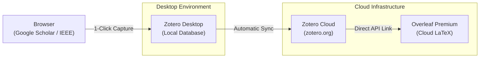

# Environment Setup & Workflow Guide

This document serves as the master reference guide for maintaining and rebuilding the environment setup for this Applied Information Science Master's Thesis.

---

## 1. Where to Store: OneDrive & GitHub Configuration

To maintain real-time passive cloud backup alongside explicit version history, follow this architecture exactly to prevent synchronization file locks.

### Root Folder Layout
```text
OneDrive - University/
└── Thesis_Project/
    ├── document/        # LaTeX template & written sections (pulled from Overleaf if needed)
    ├── docs/            # Environment and documentation guides
    └── src/             # Coding scripts, data loaders, and model setups

## 2. GitHub Repository & Configuration

git init
git add .
git commit -m "Initial commit: Thesis environment setup"

git remote add origin [https://github.com/walter-telsnig/Master-s-Thesis-WS26-](https://github.com/walter-telsnig/Master-s-Thesis-WS26-)
git branch -M main
git push -u origin main

## 3. Python Dependency & Virtual Environment Management
# Windows
python -m venv .venv

# Create a clean starting requirements list
echo -e "pandas\nnumpy\npython-dotenv" > requirements.txt

# Run installation mapping
pip install -r requirements.txt

# Snap precise version configurations directly back to disk
pip freeze > requirements.txt

### 3.1 Daily Pipeline for Adding Libraries
Run local environment installation: pip install <package-name>
Overwrite the deployment blueprint tracker: pip freeze > requirements.txt
Commit and push requirements.txt straight to GitHub.

## 4. Bibliography Automation (Zotero & Overleaf Premium)



## Tool Installation Checklist

1. **Zotero Desktop Application** (Free, Open-Source): [zotero.org](https://www.zotero.org/)
2. **Zotero Connector** (Browser Extension for Chrome, Firefox, or Edge).
3. **Better BibTeX (BBT) Add-on**: 
   * Download the latest `.xpi` file from the [Better BibTeX Releases Page](https://github.com/retorquere/zotero-better-bibtex/releases).
   * Inside Zotero Desktop, navigate to **Tools > Add-ons**, drag and drop the `.xpi` file, and install. Restart Zotero when prompted.

---

## Configuration Protocol

### Step 1: Create a Dedicated Collection
Open Zotero Desktop, right-click **My Library**, select **New Collection**, and name it matching your project (e.g., `Master-s-Thesis-WS26`).

### Step 2: Configure Predictable Citation Keys
1. In Zotero, open **Edit > Preferences** (Windows) or **Zotero > Settings** (macOS).
2. Go to **Better BibTeX** > **Citation keys** tab.
3. Change the **Citation key formula** input to:
   ```text
   [auth:lower][year][shorttitle:lower:select=1]

Step 3: Link Zotero Cloud to Overleaf Premium

    Ensure Zotero Desktop is syncing online via Preferences > Sync.

    Log into Overleaf, go to Account > Account Settings, scroll down to Integration Settings, find Zotero Integration, and click Connect.

    Open your specific LaTeX thesis project inside Overleaf.

    Click the New File icon (top-left button tree tree), select From Bibliography.

    Set:

        Bibliography Name: references.bib

        Select Service: Zotero

        Scope: Specific Collection (Choose your thesis folder)

    Click Create. A dynamically linked references.bib file will appear in your project.


## daily
Find Paper Online (Scholar/IEEE)
        │
        ▼
Click Zotero Browser Button (Saves metadata & PDF to Zotero collection)
        │
        ▼
Verify Citation Key (Generated instantly, e.g., smith2025electricity)
        │
        ▼
Open Overleaf ──> Click 'references.bib' ──> Click 'Refresh'
        │
        ▼
Cite in LaTeX Code using: \cite{smith2025electricity}


