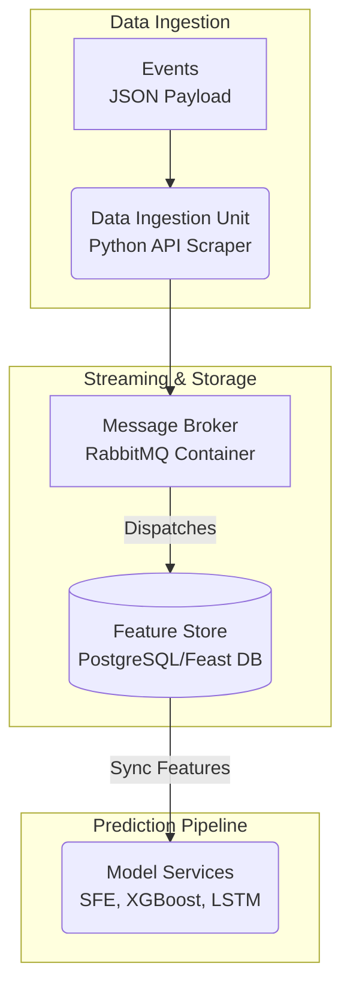

# Master Thesis Project Plan: Event-Driven MLOps for HPFC Forecasting

This document outlines the strategic direction, software architecture, and theoretical foundation of the planned Master's Thesis (Diplomarbeit) within the Applied Computer Science (Angewandte Informatik) program at AAU Klagenfurt.

---

## 1. Metadata & Title Structure

* **Prospective English Working Title:** An Event-Driven MLOps Architecture for Hourly Price Forward Curve Forecasting: Benchmarking Supply Function Equilibria against Machine Learning
* **Focus:** 50% High-Level Software Engineering & Data Pipelines / 50% Applied Economic Theory, Mathematical Optimization, and Time-Series Forecasting.
* **Key Advantage:** Full academic independence ensured by exclusively utilizing open-source software and publicly available market data (e.g., ENTSO-E, EXAA, EPEX Spot).

---

## 2. Theoretical and Experimental Framework (The Core Narrative)

This thesis bridges the traditional divide between pure economic modeling and pure data science. It implements a rigorous, empirical benchmarking framework (a "race") between structural market models and modern machine learning algorithms to generate an Hourly Price Forward Curve (HPFC).

### The Theoretical Bridge (Market & Game Theory)
1. The Foundation (Cournot): Derivation of classic quantity competition and the Nash equilibrium as a baseline for strategic market behavior.
2. The Fundamental Critique: Demonstrating why Cournot competition falls short in modern electricity markets, where market participants submit price-quantity bid functions rather than fixed quantities.
3. The Evolution (Supply Function Equilibrium - SFE): Introducing the SFE model as a mathematically realistic representation of electricity auction order books.
4. The Disruption (The Solar and Storage Twist): Extending the classical SFE framework to account for highly volatile dynamics:
   * Modeling inelastic supply with near-zero marginal costs to capture solar price cannibalization and negative pricing phases.
   * Integrating time-coupled utility-scale storage (pumped hydro/batteries) as endogenously optimized, purely opportunistic arbitrage agents.

### The Experimental Benchmark (Data Science)
The modified mathematical SFE model is benchmarked against two distinct machine learning paradigms using historical backtesting:
* Model A (Tree-Based): LightGBM or XGBoost for structured, tabular pattern recognition.
* Model B (Deep Learning): LSTM or Transformer-based networks to capture complex sequential time-series dependencies.
* The Synthesis (Hybrid Approach): Investigating whether feeding the SFE equilibrium price as an explicit feature into the ML models yields the lowest forecasting errors (RMSE, MAPE).

---

## 3. Enterprise Software Architecture (Computer Science Core)

To fulfill the rigorous requirements of an Applied Computer Science thesis, the system is designed as an Event-Driven Machine Learning Architecture utilizing microservices. The entire stack is built on free open-source software and runs locally via Docker.

### System Data Flow

### Technical Components
* Containerization: The entire infrastructure is encapsulated via docker-compose to guarantee absolute portability and reproducibility.
* Decoupling (RabbitMQ): The Data Ingestion Service operates asynchronously, retrieving API data and publishing it as events. If an ML service fails or lags, the message queue acts as a buffer.
* Single Source of Truth (Feature Store): A PostgreSQL database or a lightweight Feast deployment serves as the Feature Store. This ensures all forecasting models access identical feature vectors, completely preventing training-serving skew.
* Integrated Workspace: Development is accelerated using the Google Antigravity IDE environment, employing parallel autonomous agents for data ingestion, database configuration, and terminal-driven debugging.

---

## 4. Academic Foundation (Literature Search Validation)

A targeted literature review confirms that this topic operates at the cutting edge of energy informatics. The combined methodology is highly relevant and addresses current research gaps:

1. From Price Forecasting to Curve Forecasting (The SFE-ML Bridge):
   * Key Reference: ArXiv:2601.20226 (2026): "Parametric and Generative Forecasts of Day-Ahead Market Curves for Storage Optimization"
   * Relevance: Current literature is rapidly shifting from treating prices as a simple scalar "black box" toward modeling the underlying market supply curves to better optimize storage assets.
2. Fundamental SFE Theory in Electricity Markets:
   * Classical Framework: Klemperer, P. D., & Meyer, M. A. (1989): "Supply Function Equilibria in Oligopoly under Uncertainty" (Econometrica).
   * Relevance: Provides the strict mathematical groundwork for continuous supply curves, establishing a robust macroeconomic baseline.
3. Benchmarking and Evaluation Framework:
   * Key Reference: Literature by Rafal Weron (e.g., "Electricity price forecasting: A review of the state-of-the-art").
   * Relevance: Defines the industry-standard statistical error metrics (MAE, RMSE, Diebold-Mariano test) required to scientifically validate whether the SFE model or the ML models yield superior accuracy.